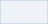

<p align="center">
  
</p>

# LNX-360

**UniFi Site Manager and network monitoring for managed service providers.**

[](https://github.com/lnxinc/monitor/actions/workflows/ci.yml)
[](https://github.com/lnxinc/monitor/actions/workflows/docker-publish.yml)
[](https://github.com/lnxinc/monitor/pkgs/container/monitor)
[](LICENSE)

LNX-360 is the network operations and monitoring platform built by [LNX Inc.](https://lnxinc.com) for managed service providers. It syncs sites and devices from UniFi Site Manager, raises incidents when a site goes offline or degrades, and tracks infrastructure health across servers, websites, SSL certificates and third-party telemetry delivered by webhook. Checks run on a schedule through dedicated drivers (HTTP, ICMP ping, TCP port, SSL certificate, SIP) with alert routing, maintenance windows and public status pages built in.

Built with Laravel 12, Inertia 2 and Vue 3.

## What it does

- Multi-protocol monitoring with a driver architecture: HTTP, ping, TCP, SSL, SIP and webhook ingest
- Per-monitor policies and notification channels: email, Slack webhooks, generic webhooks
- Queued notification delivery with automatic retries, de-duplication and flood control
- Maintenance windows to suppress noise during planned work
- UniFi Site Manager integration for automated site and device sync
- Public-facing status pages
- Centralised incident tracking with resolution notes

## Quick start with Docker

The published image contains the app, compiled front-end assets and every PHP extension it needs. The compose file adds MySQL and Redis and runs the web server, a queue worker and the scheduler from that one image. Nothing has to be built or configured on the host.

```bash
mkdir lnx360 && cd lnx360
curl -fsSLO https://raw.githubusercontent.com/lnxinc/monitor/master/compose.yaml
docker compose up -d
```

Open <http://localhost:8080/register> and create the first user. That's it.

On first start the app container generates an application key and stores it in the `storage` volume, runs the database migrations, links public storage and caches configuration. Later starts reuse the same key and run only new migrations.

### The stack

| Service | Image | Role |
|---|---|---|
| `app` | `ghcr.io/lnxinc/monitor` | NGINX + PHP-FPM serving the UI and API on port 8080 |
| `queue` | `ghcr.io/lnxinc/monitor` | `queue:work` runs monitor checks and sends notifications |
| `scheduler` | `ghcr.io/lnxinc/monitor` | `schedule:work` dispatches due monitors and UniFi sync every minute |
| `mysql` | `mysql:8.4` | Application database, persisted in the `mysql` volume |
| `redis` | `redis:7-alpine` | Cache, sessions and queue, persisted in the `redis` volume |

Every container reports health, and the queue and scheduler wait for the web app to pass its health check before starting, so migrations always finish before jobs run.

### Configuration

Every setting has a working default. To change one, create a `.env` file next to `compose.yaml` (start from [`.env.docker.example`](.env.docker.example)) and run `docker compose up -d` again.

| Variable | Default | Purpose |
|---|---|---|
| `LNX360_VERSION` | `latest` | Image tag to run. Pin a release such as `1.2.0` in production. |
| `APP_PORT` | `8080` | Host port the UI is published on. |
| `APP_URL` | `http://localhost:8080` | Public URL, used in emails and generated links. |
| `APP_KEY` | generated | Set to reuse an existing key. Leave blank to auto-generate once. |
| `DB_DATABASE` / `DB_USERNAME` / `DB_PASSWORD` | `lnx360` | MySQL credentials. Change them before exposing the stack. |
| `DB_ROOT_PASSWORD` | `lnx360-root` | MySQL root password. |
| `MAIL_*` | `log` mailer | SMTP settings for outbound alerts. |
| `UNIFI_SITE_MANAGER_API_KEY` | empty | Enables the UniFi Site Manager sync. |
| `HEARTBEAT_*`, `ALERT_*` | see below | Reliability tuning. |

Behind a reverse proxy or load balancer, set `APP_URL` to the public address and terminate TLS at the proxy. The app listens for plain HTTP on 8080.

### Day-to-day operations

```bash
docker compose pull && docker compose up -d      # update to the newest image
docker compose logs -f app queue scheduler        # follow application logs
docker compose exec app php artisan monitors:run  # run every due monitor now
docker compose exec app php artisan tinker        # poke at the app
docker compose exec mysql mysqldump -ulnx360 -plnx360 lnx360 > backup.sql
```

Three volumes hold all state: `storage` (application key, uploads, logs), `mysql` and `redis`. Back those up and the stack can be recreated anywhere with the same compose file.

### Building the image yourself

```bash
git clone https://github.com/lnxinc/monitor.git && cd monitor
docker compose -f compose.yaml -f compose.dev.yaml up -d --build
```

Or build the image on its own with `docker build -t lnx360:local .`. The [Dockerfile](Dockerfile) is a two-stage build: stage one installs Composer and npm dependencies and compiles the Vite bundle, stage two copies the result into an unprivileged PHP-FPM + NGINX runtime. Pushes to `master` and `v*` tags publish multi-architecture images (amd64 and arm64) to GHCR through the [docker workflow](.github/workflows/docker-publish.yml).

## Running without Docker

### Requirements

- PHP 8.4 with `bcmath`, `ctype`, `curl`, `mbstring`, `openssl`, `pdo` and a database driver
- Composer 2
- Node.js 22 and npm
- MySQL 8, MariaDB 10.5, PostgreSQL 13 or SQLite
- Redis for cache, sessions and queue (the database driver works too)
- A process manager for the queue worker and cron for the scheduler

### Setup

```bash
git clone https://github.com/lnxinc/monitor.git && cd monitor
composer install --no-interaction --prefer-dist
npm install
cp .env.example .env
php artisan key:generate
php artisan migrate --force
npm run build
```

### Local development

`composer run dev` starts the web server, queue listener, log tail and Vite together. Run them separately if you prefer:

```bash
php artisan serve
php artisan queue:listen --tries=1
php artisan schedule:work
npm run dev
```

### Production deployment

1. `composer install --no-dev --optimize-autoloader`
2. `npm ci && npm run build`
3. Set production values in `.env`
4. `php artisan migrate --force`
5. `php artisan config:cache && php artisan route:cache && php artisan view:cache`
6. Supervise `php artisan queue:work --sleep=1 --tries=3`
7. Cron: `* * * * * php /path/to/artisan schedule:run >> /dev/null 2>&1`
8. Give the web server user write access to `storage/` and `bootstrap/cache/`
9. On Linux, the ping driver needs the PHP process to run `ping`. Grant it with `setcap cap_net_raw+ep $(command -v ping)`.

## Monitoring and maintenance

- Run every due monitor by hand: `php artisan monitors:run`, or use **Run now** on a monitor in the UI.
- Webhook ingestion: `POST /api/webhooks/monitors/{token}` with a JSON payload.
- Health endpoint for load balancers: `GET /up`.
- Logs go to stderr in Docker (`docker compose logs`) and to `storage/logs/laravel.log` otherwise.

### Reliability tuning

| Variable | Default | Effect |
|---|---|---|
| `HEARTBEAT_MAX_ATTEMPTS` | `3` | Retries for transient check failures |
| `HEARTBEAT_INITIAL_BACKOFF_MS` | `200` | Delay before the first retry |
| `HEARTBEAT_BACKOFF_MULTIPLIER` | `2.0` | Multiplier applied to each following retry |
| `ALERT_DEDUPE_TTL_SECONDS` | `300` | Window for suppressing identical incident notifications |
| `ALERT_FLOOD_LIMIT` | `10` | Messages a channel may receive per flood window |
| `ALERT_FLOOD_WINDOW_SECONDS` | `60` | Flood-control window |

## Testing

```bash
php artisan test --compact
vendor/bin/pint --dirty
npm run lint && npm run format:check
```

CI runs the Pest suite, Pint and the front-end linters on every push and pull request.

## Brand

LNX-360 is an LNX Inc. product. Anything this project puts in front of a client (status pages, emails, exported reports, documentation) follows the LNX brand standard v1.0. The files live in [`public/brand/`](public/brand).

### Logo

| File | Use |
|---|---|
| `lnx-logo-primary.png` | Primary lockup, light backgrounds |
| `lnx-logo-reversed-white.png` | White lockup, transparent. LNX Navy and Deep Navy backgrounds only. |
| `lnx-logo-mono-navy.png` | One colour, single-ink print |
| `lnx-mark-gradient.png` | Mark alone, for avatars, favicons and badges |
| `lnx-gradient-rule.png` | The gradient rule as an image, for engines that cannot render CSS gradients |

<p>
  
</p>

Lockups are 2000 × 646, a 3.096:1 ratio. If the width divided by the height is not 3.096, it has been stretched. Clear space on every side equals the height of the mark. Minimum width is 120 px on screen and 1 in in print.

Never recolour, stretch, rotate, outline or shadow the logo, never place it on a busy photo, and never put the reversed mark on anything but Navy or Deep Navy. Use the supplied files; do not rebuild the mark in CSS, SVG or type.

### Colour

Navy is the brand. Cyan and violet are accents for rules, keylines and a single highlighted figure, never large fills and never behind type. One accented element per page.

| | Name | Hex | Role |
|---|---|---|---|
|  | LNX Navy | `#112540` | Primary ink, headings, logo |
|  | Deep Navy | `#002657` | Covers, slide and banner backgrounds |
|  | Signal Cyan | `#43BDE9` | Accent, charts, rules |
|  | Circuit Violet | `#6F52F1` | Accent, second data series |
|  | Core Magenta | `#B624FA` | Logo core only. Never in UI, charts or highlights. |
|  | Mist | `#EFF3F8` | Fills |
|  | Line | `#D3DBE5` | Rules, borders |
|  | Slate | `#5A6A80` | Secondary text, labels |
|  | Body | `#3D4C61` | Body copy |

The gradient is `linear-gradient(90deg, #43BDE9 0%, #6F52F1 100%)`, cyan to violet, left to right. It belongs to the logo. Elsewhere it is allowed only as a rule, a keyline or a thin band at a page edge. Never behind text, never as a background, never reversed or angled.

Text on colour is limited to four combinations: white on Navy, white on Deep Navy, Navy on Cyan, white on Violet. White on Cyan fails contrast and is never used.

### Typography

Two typefaces, nothing else.

- **Space Grotesk** (weights 500 and 600) for headlines, section titles and numbers that should be noticed. Tracking −2% at 20 pt and above. Fallback: Arial Bold.
- **IBM Plex Sans** (weights 400, 500, 600) for body copy, tables, captions and labels. Never below 9 pt in print. Fallback: Calibri, then Arial.
- **IBM Plex Mono** for codes, part numbers, specs and identifiers.

Headings are sentence case, never italic, one weight per level. Underline is for links only.

### Company

| | |
|---|---|
| Legal name | LNX Inc. (with the period) |
| Headquarters | 1395 Wheaton Dr Suite 500, Troy, MI 48083 |
| Phone | 833-569-5690 |
| Website | [lnxinc.com](https://lnxinc.com) |

The product UI itself follows its own design-token set in `resources/css/app.css`. The brand standard governs what the app sends out and how the project presents itself.

## License

LNX-360 is released under the [LNX-360 Source Available License](LICENSE).

You are free to use, modify and deploy this software as long as you keep attribution to LNX Inc. Reselling or commercially redistributing the software as a product or SaaS offering requires prior written permission. Contact **sari@lnxinc.com** for commercial redistribution licensing.
